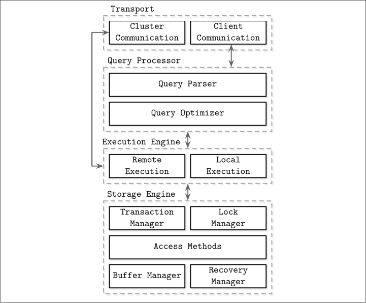
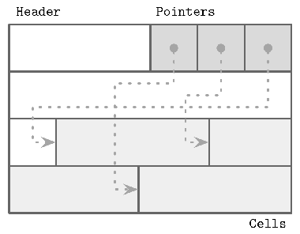
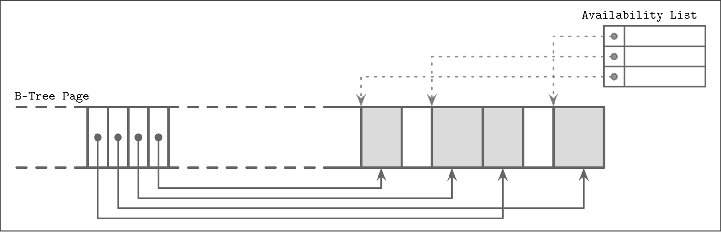
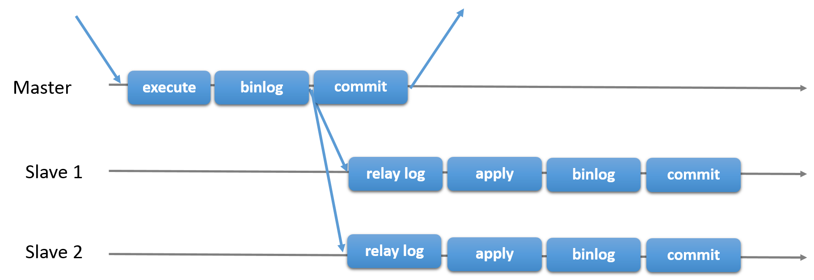
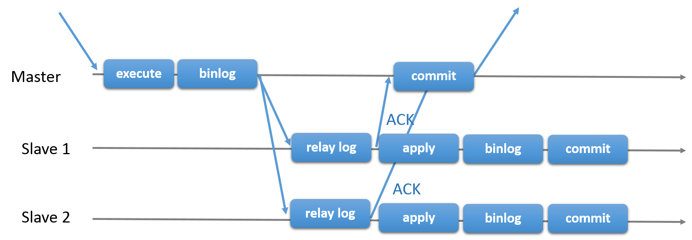

# Database Concepts

1. reference
   - Glossary part in MySQL docs.
   - Database Internals
   - other

1. DBMS taxonomy
   - Online transaction processing (OLTP) databases
   - Online analytical processing (OLAP) databases
   - Hybrid transactional and analytical processing (HTAP) — combine properties of both OLTP and OLAP stores

## Index

1. MySQL index types
   - B+ tree index
   - hash index — for `MEMORY` tables
     - adaptive hash index — an optimization for InnoDB tables that can speed up lookups using `=` and `IN` operators, by constructing a hash index in memory. MySQL monitors index searches for InnoDB tables, and if queries could benefit from a hash index, it builds one automatically for index **pages** that are frequently accessed, depending on the search pattern against the B-tree index. A hash index can be partial; the whole B-tree index does not need to be cached in the buffer pool.
   - `FULLTEXT` index, inverted lists, in tandem with Full-Text Search Functions
   - `SPATIAL` index, R-trees

1. keys
   - primary key
     - compound key — primary key consisting of two or more columns
     - natural key or surrogate key (aka. synthetic key, typically a primary key)
   - foreign key — help keep spread-out data consistent

1. selectivity and cardinality
   - selectivity — cardinality divided by the number of records in the table; high selectivity means that the column values are relatively unique, and can retrieved efficiently through an index
   - cardinality — the number of different values in a table column; when queries refer to columns that have an associated index, the cardinality of each column influences which access method is most efficient
     - inspect — `SHOW INDEX`, output includes an estimate of the number of unique values in the index
     - index hints when uneven distribution — if the index have a very uneven distribution, the cardinality might not be a good way to determine the best query plan; might need to use index hints to pass along advice about which lookup method is more efficient for a particular query
     - random dive — a technique for quickly estimating cardinality: InnoDB samples pages at random from the index and uses that data to estimate

1. index optimization
   - large data update — bootstrap with delete indexes before and re-create after
   - covering index — an index that includes all the columns retrieved by a query. Instead of using the index values as pointers to find the full table rows, the query returns values from the index structure. Any column index or composite index could act as a covering index
     - in `EXPLAIN` — `Using index` in the `Extra` column
   - standalone column — `id + 1` and functions does not utilize the index, also implicit type or collation conversion which uses `CAST` function
   - composite index, aka. multiple-column index — prefixed index search capability; composite indexes outperform separated single column indexes; order matters, selective first or the most frequently used first
   - prefix indexing — `KEY_BLOCK_SIZE` like `max_sort_length`, for `BLOB`, `TEXT`, `VARCHAR`
   - ordering of index
   - index condition pushdown (ICP) — an optimization that, when searching secondary indexes, pushes part of a `WHERE` condition down to the storage engine if parts of the condition can be evaluated using fields from the index, can reduce the number of times the storage engine must access the base table and the number of times the MySQL server must access the storage engine, see [8.2.1.6 Index Condition Pushdown Optimization](https://dev.mysql.com/doc/refman/8.0/en/index-merge-optimization.html) for details
     - in `EXPLAIN` — `Using index condition` in the `Extra` column
   - [8.2.1.3 Index Merge Optimization](https://dev.mysql.com/doc/refman/8.0/en/index-merge-optimization.html) — retrieves rows with multiple `range` scans and merges their results into one
     - in `EXPLAIN` — `index_merge` in the `type` column and more in `Extra` column

1. index structure, delete and purge
   - indexes
     - clustered indexes — primary key index, where data records held at left nodes; updated in-place, have hidden system columns
     - secondary indexes — nodes hold pointers to clustered index nodes, no hidden system columns, when updated, old secondary index records are delete-marked, new records are inserted, and delete-marked records are eventually purged; when undo, cluster index looked up, covering index technique not used
   - index queries — fewer rows to scan; help `ORDER BY` and `GROUP BY` even save temporary tables; random IO to sequential IO
   - delete and purge
     - delete — internally delete is an update on delete mark
     - purge — a type of garbage collection performed by one or more separate background threads (controlled by `innodb_purge_threads`) that runs on a periodic schedule, parses and processes undo log pages from the history list for removing delete-marked clustered and secondary index records
     - history list — a list of transactions with delete-marked records scheduled to be processed by the InnoDB purge operation. Recorded in the undo log.

1. 范式 — 为了解决四种异常。高级别范式的依赖于低级别的范式，1NF 是最低级别的范式
   - example: 函数依赖
     | Sno | Sname | Sdept | Mname | Cname | Grade |
     | :---: | :---: | :---: | :---: | :---: |:---:|
     | 1 | 学生-1 | 学院-1 | 院长-1 | 课程-1 | 90 |
     | 2 | 学生-2 | 学院-2 | 院长-2 | 课程-2 | 80 |
     | 2 | 学生-2 | 学院-2 | 院长-2 | 课程-1 | 100 |
     | 3 | 学生-3 | 学院-2 | 院长-2 | 课程-2 | 95 |
     1. Sno -> Sname, Sdept
     1. Sdept -> Mname
     1. Sno, Cname -> Grade
   - 函数依赖
     - 键码 — 能决定其他所有属性的最小属性集合
     - 完全函数依赖，部分函数依赖 — Sdept -> Mname; all other columns -> Grade
     - 传递函数依赖 — Sno -> Sdept -> Mname
   - 四种异常
     - 冗余数据 — 例如学生-2 出现了两次
     - 修改异常 — 修改了一个记录中的信息，但是另一个记录中相同的信息却没有被修改
     - 删除异常 — 删除一个信息，那么也会丢失其它信息。例如删除了 课程-1 需要删除第一行和第三行，那么 学生-1 的信息就会丢失
     - 插入异常 — 例如想要插入一个学生的信息，如果这个学生还没选课，那么就无法插入
   - 范式
     - 第一范式 (1NF) — 属性不可分
     - 第二范式 (2NF) — 每个非主属性完全函数依赖于键码。可以通过分解来满足。如将例子中的表分为函数依赖分别为 1., 2. 和 3. 的两个表
     - 第三范式 (3NF) — 非主属性不传递函数依赖于键码，如将上例的第一个表进一步分为函数关系分别为 1. 和 2. 的两个表
   - normalization — no duplicate or compound columns: refining a database design to ensure that each independent piece of information is in only one place (except for foreign keys)

## File and Page Structure

1. DBMS architecture  
   
   - memory based, disk based
     - durability of memory based stores — logs and checkpointing
   - column oriented or row oriented — how the data is stored on disk: row- or column-wise
     - column oriented stores — values for the same column are stored contiguously on disk, a good fit for analytical workloads that compute aggregates
       - two pioneer column-oriented stores — MonetDB and C-Store
       - redundant row ID or virtual ID — row ID kept for each value or use offset as implicit ID, to reconstruct the row for things like joins, filtering, and multirow aggregates
     - wide column stores — e.g. BigTable, HBase, as a multidimensional map, columns are grouped into column families (usually storing data of the same type), and inside each column family, data is stored row-wise, no relation with column oriented stores
   - storage structure variables — buffering, immutability, and ordering

1. files
   - data files
     - index-organized tables (IOT)
     - heap-organized tables (heap files)
     - hash-organized tables (hashed files)
   - index files
     - primary index, secondary index
     - clustered index, non-clustered index — data records in the clustered case are usually stored in the same file or in a clustered file, where the key order is preserved

1. slotted page — organize the page into a collection of slots or cells and split out pointers and cells in two independent memory regions residing on different sides of the page  
   
   - overhead — a pointer array
   - gc — space can be reclaimed by defragmenting and rewriting the page
   - dynamic layout — from outside the page, slots are referenced only by their IDs, so the exact location is internal to the page
   - order — only need to reorganize pointers addressing the cells to preserve the order
   - grow — size grow towards free space in the center
   - fragmented page and availability list — like mark sweep GC algorithm, deletion adds deletion mark and updates an in-memory availability list; when inserting a new cell, we first check the availability list to find if there’s a segment where it may fit  
     
     - example: SQLite freeblocks — SQLite calls unoccupied segments freeblocks and stores a pointer to the first freeblock in the page header, along with the total number of free space to determine if new data can fit after defragmenting
     - segment fit
       - first fit
       - best fit — try to find a segment for which insertion leaves the smallest remainder
   - possible page header content
     - magic number — validation and sanity checks
     - B-tree sibling links
     - rightmost pointers or high key
     - overflow page link

1. paged binary trees — improve locality by grouping nodes into pages, making next nodes on the same page for some nodes; operations are nontrivial

1. B-tree — increase node fanout, to reduce tree height, the number of node pointers, and the frequency of balancing operations
   - leaf level sibling node pointers — simplify range scans, double-linked in some implementations
   - from bottom to top — the number of leaf nodes grows, which propagates to higher levels and increases the number of internal nodes and tree height
   - B+ tree — store values only in leaf nodes, affect higher level nodes only during splits and merges
   - B* tree — when splitting, instead of splitting a single node into two half-full ones, the algorithm splits two nodes into three nodes, each of which is two-thirds full
     - B link tree — on top of B* tree, add high keys and sibling link pointers
   - some drawbacks
     - write amplification — see [Disk](./OS-notes.md#Disk)
     - space amplification — extra space reserved to make updates possible
   - tbd
   <!-- TODO -->
   <!-- - more tbd from binary search on P67 -->

1. B-tree variants — tbd
   <!-- TODO -->
   - Copy-on-write B-Tree — immutable nodes
   - Lazy B-Tree — reduce the number of I/O requests from subsequent same-node writes by buffering updates to nodes
     - example — WiredTiger
   - Flash Disk Tree (FD-Tree) — buffer updates in a small B-Tree; fractional cascading
   - Buzzword-Tree (Bw-Tree) — separate B-Tree nodes into several smaller parts that are written in an append-only manner
   - Cache-oblivious B-Tree — allow treating on-disk data structures in a way that is very similar to how we build in-memory ones

1. Log-Structured Storage — immutable storage, append-only modification, records have to be reconstructed from multiple files
   - Log-Structured Merge Trees (LSM Trees) — append-only storage and merge reconciliation
   - tbd
   <!-- TODO -->

## Transaction

1. transaction processing and recovery
   - page cache
     - flush — flush when dirty page evicted; or a separate background process that cycles through the dirty pages that are likely to be evicted and flush them for quick eviction
     - durability — coordinated by the checkpoint process: ensure the write-ahead log (WAL) and page cache work in lockstep
     - optimization
       - pinning — pinned pages are kept in memory for a longer time, like nodes near a B-tree root
       - eviction strategy — like page replacement algorithms in operating systems
   - recovery
     - write-ahead log (WAL, aka commit log) — append-only, persisted before page modified and until page flushed
       - order — log sequence number (LSN), an internal counter or a timestamp
       - checkpoint and trim — when a checkpoint reached, WAL trimmed since log records up to a certain mark are fully persisted and not required anymore
         - sync checkpoint — forces all dirty pages to be flushed on disk
         - fuzzy checkpoint — pages flushed asynchronously from `begin_checkpoint` log record to `end_checkpoint` log record; the `last_checkpoint` pointer stored in the log header contains the information about the last successful checkpoint, from which the recovery process will start
     - operation (logical) log and physical log
       - operation log, or logical log — stores operations that have to be performed against the current state
       - physical log — stores complete page state or byte-wise changes to it
     - steal and force
       - steal policy — a recovery method that allows flushing a page modified by the transaction even before the transaction has committed
       - no-steal policy — does not allow flushing any uncommitted transaction contents on disk; only redo log required for recovery
       - force policy — all pages modified by the transactions to be flushed on disk before the transaction commits; no additional work required for recovery with overhead when committing
       - no-force policy — allows a transaction to commit even if some pages modified during this transaction were not yet flushed on disk
     - ARIES (Algorithm for Recovery and Isolation Exploiting Semantics) — a steal/no-force recovery algorithm
       - physical redo — changes can be installed quicker when recovery
       - logical undo — improve concurrency during normal operation
         - compensation log records (CLR) — the undo process is logged as well to avoid repeating them
       - three phase
         1. analysis phase — identifies dirty pages in the page cache and transactions that were in progress at the time of a crash
         1. redo phase — repeats the history up to the point of a crash and restores the database to the previous state, and WAL used for repeating history
         1. undo phase — rolls back all incomplete transactions and restores the database to the last consistent state

1. concurrency control
   - optimistic concurrency control (OCC)
     - three phases
       - read phase — get transaction dependencies (read set), and the side effects (write set), in its own private context, without making any of the changes visible to other transactions
       - validation phase — read and write set checked for conflicts, restart read phase if necessary
         - backward-oriented and forward-oriented — checking for conflicts with the transactions that have already been committed (backward-oriented), or with the transactions that are currently in the validation phase (forward-oriented)
       - write phase — if validation passed, commit write set from the private context to the database state
     - atomicity — validation and write should be done automatically; critical section
   - multiversion concurrency control (MVCC) — by allowing multiple record versions and using monotonically incremented transaction IDs or timestamps
     - often used for implementing snapshot isolation
   - pessimistic (aka conservative) concurrency control (PCC) — block or abort when conflicts
     - implementations
       - timestamp ordering implementation — lock free, whether or not transaction operations are allowed to be executed is determined by whether or not any transaction with an earlier timestamp has already been committed
       - lock-based implementations, like two-phase locking (2PL)

1. ACID — transaction properties
   - atomicity — when transaction ends, either all the changes succeed or all the changes undone
   - consistency — in transactions, the database remains in a consistent state at all times, after each commit or rollback; queries never see mix of old and new values
   - isolation — transactions cannot interfere with each other or see each other's uncommitted data; achieved through the locking mechanism
   - durability — the changes made by transactions are safe from power failures, system crashes, race conditions, or other potential dangers that many non-database applications are vulnerable to

1. read phenomena
   - dirty read — read data that was updated by another transaction but not yet committed, possible in `READ UNCOMMITTED`
   - non-repeatable read — within the same transaction, a later query retrieve data should be the same but changed by another transaction committing in the meantime, possible in `READ COMMITTED` and below
   - phantom read — within the same transaction, a row that appears in the result set of a query, but not in the result set of an earlier query, possible in `REPEATABLE READ` and below
     - gap lock needed, see next-key locks below — locking all the rows from the first query result set does not prevent the changes that cause the phantom to appear

1. write anomalies
   - lost update — transactions read the same value and update it respectively, but only the update that last committed take effect, other updates lost
   - dirty write — write values that are dirty read
   - write skew — each individual transaction respects the required invariants, but their combination does not satisfy these invariants; for example, two transaction withdraw $100 from an account with $150, making the balance negative while nonnegative for each transaction

1. isolation levels
   - see [`SET TRANSACTION`](./SQL_notes.md#SET-TRANSACTION)
   - snapshot isolation (SI) — [zhihu](https://zhuanlan.zhihu.com/p/54979396), read from the snapshot with values committed before the transaction’s start timestamp (no phantom read), first committer wins when write-write conflict
     - example — Google Percolator, `REPEATABLE READ` in MySQL

1. consistent read — isolation: A read operation that uses snapshot information to present query results based on a point in time, regardless of changes performed by other transactions running at the same time
   - related isolation level — `READ COMMITTED` and `REPEATABLE READ` isolation levels
   - lock-free — because a consistent read does not set any locks on the tables it accesses, other sessions are free to modify those tables while a consistent read is being performed on the table
   - undo log to mitigate lock congestion — If queried data has been changed by another transaction, the original data is reconstructed based on the contents of the undo log. This technique avoids some of the locking issues that can reduce concurrency by forcing transactions to wait for other transactions to finish.
   - locking read — use locks, locks on newest data, which means read view will be refreshed even in `REPEATABLE READ`

1. MVCC — multiversion concurrency control, technique used in consistent read
   - read view — the trx ids of those transactions for which a consistent read should not see the modifications to the database, unchanged for `REPEATABLE READ` while refreshed for every read for `READ COMMITTED`
     - related methods in class `MVCC` — `view_open` (allocate and create a view), `view_close`, `view_release` see [dev.mysql](https://dev.mysql.com/doc/dev/mysql-server/latest/classMVCC.html)
     - some transaction ID attributes, see [dev.mysql](https://dev.mysql.com/doc/dev/mysql-server/latest/classReadView.html)
       - `ids_t m_ids` — set of RW transactions that was active when this snapshot was taken
       - `trx_id_t m_low_limit_id` — the read should not see any transaction with trx id >= this value
       - `trx_id_t m_up_limit_id` — the read should see all trx ids < this value
       - `trx_id_t m_creator_trx_id` — trx id of creating transaction, set to TRX_ID_MAX for free views
       <!-- - `trx_id_t m_view_low_limit_no` — the read views don't need to access undo log records for MVCC for trx ids <= this value -->
   - rollback segment — the storage area containing the undo logs
   - undo log — the information necessary to rebuild the content of the row before it was updated
     - insert undo log — only needed when rollback
     - update undo log — for rollback and consistent reads, cannot be discarded if potentially required by any snapshot to build an earlier version
   - three internal columns for each row
     - `DB_TRX_ID` — 6 byte, transaction identifier, the last transaction that inserted or updated the row
     - `DB_ROLL_PTR` — 7 byte, roll pointer, points to an undo log record written to the rollback segment
     - `DB_ROW_ID` — 6 byte, a row ID that increases monotonically as new rows are inserted
   - constructing a row with `DB_TRX_ID` and a read view when `SELECT`
     - `DB_TRX_ID` < `m_up_limit_id`，表示该数据行快照时在当前所有未提交事务之前进行更改的，因此可以使用。
     - `DB_TRX_ID` >= `m_low_limit_id`，表示该数据行快照是在事务启动之后被更改的，因此不可使用。
     - `m_up_limit_id` <= `DB_TRX_ID` < `m_low_limit_id`, 需要根据隔离级别再进行判断：
       - 提交读：如果 `DB_TRX_ID` 在 `m_ids` 列表中，表示该数据行快照对应的事务还未提交，则该快照不可使用。否则表示已经提交，可以使用。
       - 可重复读：都不可以使用。因为如果可以使用的话，那么其它事务也可以读到这个数据行快照并进行修改，那么当前事务再去读这个数据行得到的值就会发生改变，也就是出现了不可重复读问题。
     - 在数据行快照不可使用的情况下，需要沿着 Undo Log 的回滚指针 `DB_ROLL_PTR` 找到下一个快照，再进行上面的判断。
     - deduction — no phantom read if no locking reads following consistent reads in `REPEATABLE READ`

1. locks
   - lock granularity
     - db lock
     - table lock — at MySQL server; used when DDL, `LOCK TABLE` and more
     - page lock
     - row lock — at InnoDB engine
   - table or row lock types
     - S lock, aka read lock — shared
     - X lock, aka write lock — exclusive
   - intention locks — table-level locks that indicate which type of lock (shared or exclusive) a transaction requires later for a row in a table; do not block anything except table lock requests
     - IX lock — before a transaction can acquire an exclusive lock on a row in a table, it must first acquire an IX lock on the table
     - IS lock — before a transaction can acquire a shared lock on a row in a table, it must first acquire an IS lock or stronger on the table
   - insert intention lock — a type of gap lock set by `INSERT` operations prior to row insertion, signals the intent to insert, but does not block each other if not inserting at the same position within the gap
   - `AUTO-INC` locks — a special table-level lock taken by transactions inserting into tables with `AUTO_INCREMENT` columns; can be in other mode, controlled by `innodb_autoinc_lock_mode`, trade off between predictable sequences of auto-increment values and concurrency, see [docs](https://dev.mysql.com/doc/refman/8.0/en/innodb-auto-increment-handling.html)
   - predicate locks for `SPATIAL` indexes — tbd
   - row locks — actually index-record locks
     - row locking mechanism — a locking read, an `UPDATE`, or a `DELETE` generally set locks (normally next-key locks) on every index record that is scanned in the processing of the SQL statement
       - secondary index — if a secondary index is used in a search and locks to set are exclusive, InnoDB also retrieves the corresponding clustered index records and sets locks on them
       - no index — scan the entire table to process the statement, every row of the table becomes locked
       - `INSERT` — sets an exclusive record lock on the inserted row after setting insert intention lock; if duplicate-key error, sets a shared lock on the duplicate index record and then sets the exclusive lock; see docs for possible deadlock
       - `INSERT` with different clauses and other situations — see [docs](https://dev.mysql.com/doc/refman/8.0/en/innodb-locks-set.html)
     - record locks — a lock on an index record; if a table is defined with no indexes, InnoDB creates a hidden clustered index and uses this index for record locking
     - gap locks — a lock on a gap between index records, or a lock on the gap before the first or after the last index record; a gap might span a single index value, multiple index values, or even be empty
       - purely inhibitive — only purpose is to prevent other transactions from inserting to the gap
       - not used in single row search on unique index — not needed for statements that lock rows using a unique index to search for a unique row. (This does not include the case that the search condition includes only some columns of a multiple-column unique index; in that case, gap locking does occur.)
       - not conflicting — conflicting locks can be held on a gap by different transactions. The reason conflicting gap locks are allowed is that if a record is purged from an index, the gap locks held on the record by different transactions must be merged.
       - can co-exist — a gap lock taken by one transaction does not prevent another transaction from taking a gap lock on the same gap; no difference between shared and exclusive gap locks
       - disable — in `READ COMMITTED` or below gap locking is used only for foreign-key constraint checking and duplicate-key checking
     - next-key lock — a combination of a record lock on the index record and a gap lock on the gap before the index record; in `REPEATABLE READ`, InnoDB uses next-key locks for searches and index scans (if locking reads), which prevents phantom rows; for the range towards infinity, next-key is the “supremum” pseudo-record having a value higher than any value actually in the index
     - example — see [zhihu](https://zhuanlan.zhihu.com/p/149228460) for detailed
       ```SQL
       -- definition
       CREATE TABLE `test` (
         `id` INT(11) PRIMARY KEY AUTO_INCREMENT,
         `xid` INT, KEY `xid` (`xid`),
         `v` INT DEFAULT 1
       ) ENGINE=InnoDB;
       -- INSERT INTO test (xid) VALUES (1), (3), (5), (8), (11);
       INSERT INTO test (xid, v) VALUES (1, 1), (3, 3), (5, 5), (8, 8), (11, 11);
       ```
       ```SQL
       -- session A)
       START TRANSACTION;
       SELECT * from test where xid = 8 FOR UPDATE;
       -- locked in xid: (5, 8], (8, 11)
       -- session B)
       START TRANSACTION;
       INSERT INTO test (xid) VALUES (4);  -- not blocked
       INSERT INTO test (xid) VALUES (11); -- not blocked
       UPDATE test SET v = 0 where xid = 5 -- not blocked
       UPDATE test SET v = 0 where xid = 11 -- not blocked
       INSERT INTO test (xid) VALUES (5);  -- will block
       INSERT INTO test (xid) VALUES (8);  -- will block
       INSERT INTO test (xid) VALUES (10); -- will block
       ```

1. locks and latches
   - locks — acquired on the key
   - latches — guard the physical tree representation (page contents and the tree structure) during node splits and merges, and page content insert, update, and delete; can be implemented by read write lock on page
     - latch crabbing, aka latch coupling — release latch when child node successfully located or no merge or split expected, in contrast to grabbing all the latches on the way from the root to the target leaf
     - latch upgrading — write operations first acquire exclusive locks only at the leaf level. If the leaf has to be split or merged, the algorithm walks up the tree and attempts to upgrade a shared lock to an exclusive one for necessary nodes

1. locking protocols
   - 三级封锁协议
     - 一级封锁协议 — 事务 T 要修改数据 A 时必须加 X 锁，直到 T 结束才释放锁。解决 lost update。
     - 二级封锁协议 — 在一级的基础上，要求读取数据 A 时必须加 S 锁，读取完马上释放 S 锁。解决 dirty read。
     - 三级封锁协议 — 在二级的基础上，要求直到事务结束了才能释放 S 锁。解决 non-repeatable read。
   - two phase locking protocol — sufficient condition for being serializable
     - expanding phase, aka growing phase — locks are acquired and no locks are released
     - shrinking phase — locks are released and no locks are acquired
     - implication — a transaction cannot acquire any locks as soon as it has released at least one of them
     - avoid deadlock — break the cycle
       - wait-die strategy — a transaction can be blocked only by a transaction with a higher timestamp, aborted and restarted otherwise
       - wound-wait strategy — a transaction can be blocked only by a transaction with a lower timestamp, abort and restart if higher
     - conservative 2PL to address deadlock — requires transactions to acquire all the locks before they can execute any of their operations and abort if they cannot

## Distributed

1. 3V
   - Volume
   - Velocity
   - Variety — unstructured data, like documents, pictures, audios and videos

1. partition / sharding
   - table partitioning
     - horizontal partitioning — partitioning rows
     - vertically partitioning — partitioning columns, tables, or schemas
   - partitioning types in MySQL, horizontal, error when cannot decide partition
     - `RANGE` partitioning — partitions based on column values falling within a given range
     - `LIST` (mapping table) partitioning — partitions based on column values matching one of a set of discrete values
     - `HASH` partitioning — partitions based on user provided hash function on column values
       - `LINEAR HASH` — data is less likely to be evenly distributed, but adding, dropping, merging, and splitting of partitions is made much faster
       - `KEY` partitioning — similar to `HASH`, except that MySQL supplies the hashing function
     - composite partitioning — with `SUBPARTITION`
   - other partitioning strategy
     - consistent hashing — tbd

1. problems when distributed and possible solutions
   - foreign key constraint
   - triggers and stored procedures
   - transaction — use distributed transaction
   - join
     - use redundant data to avoid joining, use with caution
     - use external tools, e.g. search engine
     - join on client, but sorted paging is costly after joining client
   - index uniqueness problem
     - use GUID — global index on whole table, local index on a single partition
     - ID range for each partition
     - ID generator
       - UUID
       - MySQL based
         - single — a MySQL instance solely for generating `auto_increment` IDs
         - cluster — several MySQL instances for generating `auto_increment` IDs, with `@@auto_increment_offset` and `@@auto_increment_increment` set
         - ID range optimization — each time get a range of ID instead of a single ID, can use a field for optimistic locking
       - Redis `INCR`
       - snowflake — timestamp - machine ID - sequence, tbd
         - backward time drift alleviation — switch off time synchronization; pause for some time and restart; throw error; allocate cyclic drift bits, incremented upon backwardness

1. partition benefits
   - overcome physical partition limit — makes it possible to store more data in one table than can be held on a single disk or file system partition
   - convenience for data manipulation — operate on partitions, e.g. easily delete old data if partitioned by date
   - partition pruning, partition-wise joins — optimizer: do not scan partitions where there can be no matching values
   - concurrency — perform updates on multiple partitions simultaneously

1. replication
   - primary-secondary replication
     - master failover — promoting a replica to become a new master
     - asynchronous or semi-synchronous  
         
       
     - binlog 线程 ：负责将主服务器上的数据更改写入二进制日志（binary log）中
     - I/O 线程 ：负责从主服务器上读取二进制日志，并写入从服务器的中继日志（relay log）
     - SQL 线程 ：负责读取中继日志，解析出主服务器已经执行的数据更改并在从服务器中重放（replay）
   - 读写分离 — 主服务器处理写操作以及实时性要求比较高的读操作，而从服务器处理读操作
     - 主从服务器负责各自的读和写，极大程度缓解了锁的争用
     - 增加冗余，提高可用性

## InnoDB

1. MyISAM
   - 事务：InnoDB 是事务型的，可以使用 Commit 和 Rollback 语句。
   - 并发：MyISAM 只支持表级锁，而 InnoDB 还支持行级锁。
   - 外键：InnoDB 支持外键。
   - 备份：InnoDB 支持在线热备份。
   - 崩溃恢复：MyISAM 崩溃后发生损坏的概率比 InnoDB 高很多，而且恢复的速度也更慢。
   - 其它特性：MyISAM 支持压缩表和空间数据索引。

1. persistence
   - locations
     - databases — directories within `/data`
     - tables — files
     - triggers — files
   - system tablespace — data files (ibdata files) containing the metadata for InnoDB-related objects, and the storage areas for the change buffer, and the doublewrite buffer. It may also contain table and index data for InnoDB tables if tables were created in the system tablespace instead of file-per-table or general tablespaces
   - buffer
     - change buffer — data structure that records DML changes to pages in nonunique secondary indexes: changes buffered when the relevant page from the secondary index is not in the buffer pool
       - merge — when the relevant index page is brought into the buffer pool while associated changes are still in the change buffer, the changes for that page are applied in the buffer pool
       - persistence — the change buffer is part of the system tablespace
       - inspect — `SHOW ENGINE INNODB STATUS`
     - InnoDB doublewrite buffer — a storage area in the system tablespace where InnoDB writes pages that are flushed from the buffer pool before writing them to their proper positions in the data file; if crashed in the middle of a page write, InnoDB can find a good copy of the page from the doublewrite buffer during crash recovery
       - overhead — data is written to the doublewrite buffer as a large sequential chunk, with a single `fsync()` call to the OS

1. page
   - default page size — 16 KB
   - stored off-page — not stored in page, does not effect main index, but a 20 B pointer is stored
   - page flush points
     - redo log checkpointing
     - page eviction
     - server shutting down
     - background page flush — InnoDB attempts to perform tasks such as flushing dirty pages from the buffer pool and writing changes from the change buffer to the appropriate secondary indexes, in a way that does not adversely affect the normal working of the server
       - variable `innodb_io_capacity` — InnoDB estimates the I/O bandwidth available for background tasks based on the set value
       - variable `innodb_flush_neighbors` — set to 0 for SSD

1. InnoDB row formats — tbd

1. logs
   - [15.6 InnoDB On-Disk Structures](https://dev.mysql.com/doc/refman/8.0/en/innodb-on-disk-structures.html)
   - [5.4 MySQL Server Logs](https://dev.mysql.com/doc/refman/8.0/en/server-logs.html)
     - error log
     - general query log
     - binary log
     - relay log
     - slow query log
     - DDL log (metadata log)
     - transaction related logs
